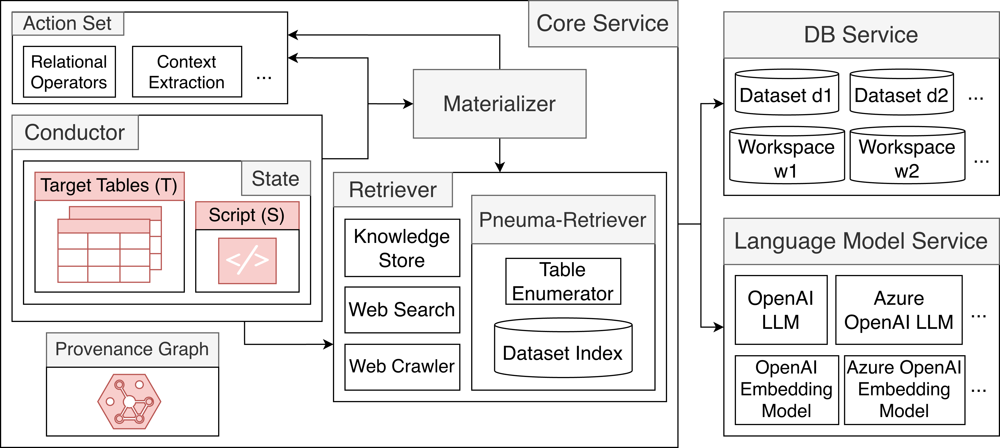

# Pneuma-Seeker

**Pneuma-Seeker** is a system that reifies an *active information need* over tabular data as a relational data model $(\mathcal{T}, S)$, where:

- $\mathcal{T}$ is a set of views derived from the underlying dataset (table collection)
- $S$ is a Python script defined over $\mathcal{T}$

The system fulfills the information need by executing $S$.

---

# How to Run the System

First, prepare the environment:

```bash
conda create --name pneuma_seeker python=3.12.9
pip install -r requirements.txt
```

You may modify configuration values through the `.env` file. Refer to `src/pneuma_seeker/shared/config.py` for all available configuration options.

Then, run the backend:

```bash
cd src/pneuma_seeker
nohup fastapi dev main.py --host 0.0.0.0 --port 8000 >> main.out &
```

## MacOS Note

On MacOS, FastAPI does not work well with nohup. Use the following instead:

```bash
fastapi dev main.py > main.out 2>&1
```

## Running the Frontend

Clone the UI repository and run OpenWebUI:

```bash
cd ..
git clone https://github.com/luthfibalaka/pneuma-seeker-ui.git
cd pneuma-seeker-ui
git checkout stable-0.6.22
pip install .
nohup open-webui serve >> output.out &
```

After launching the frontend, import all functions in `openwebui_functions` into the OpenWebUI interface so the frontend can call the Pneuma-Seeker backend.


# Running Unit Tests

```bash
cd ./tests/pneuma_seeker
python -m unittest discover
```

# Code Structure

```
pneuma_seeker/
├── data_src/                 # Datasets used in experiments
├── experiments/              # Research experiments and baselines
├── openwebui_functions/      # OpenWebUI functions that call the Pneuma-Seeker backend
│
├── src/pneuma_seeker/
│   ├── provenance/           # ProvenanceGraph implementation
│   │
│   ├── services/
│   │   ├── core/             # Core system components (Conductor, Materializer, Retriever)
│   │   ├── db/               # DBService: interface to datasets and workspace databases
│   │   └── language_model/   # LMService: interface to LLMs and embedding models
│   │
│   ├── shared/               # Shared schemas, utilities, and common functionality
│   ├── templates/            # (T,S) HTML templates used by the frontend
│   │
│   ├── chat_session.py       # Chat session instantiated for each (user, chat) pair
│   ├── session_manager.py    # Manages chat sessions for main.py
│   └── main.py               # FastAPI endpoints (backend entry points)
│
├── tests/                    # Unit tests
├── configs/                  # Configuration files
├── .env                      # Sample environment configuration
├── requirements.txt          # Python dependencies
└── README.md                 # Project documentation
```
