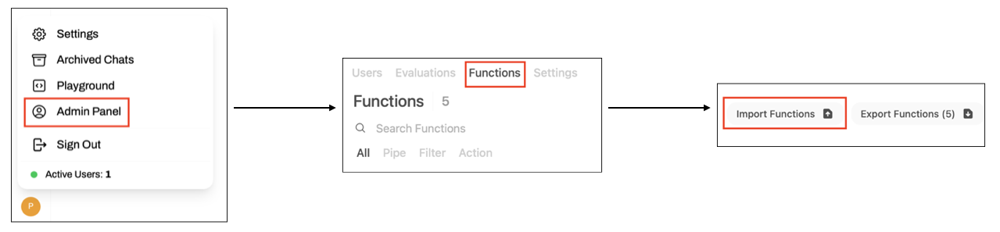

# Pneuma-Seeker

[](https://arxiv.org/abs/2603.10747)

**Pneuma-Seeker** is a system that reifies an *active information need* over tabular data as a relational data model $(\mathcal{T}, S)$, where:

- $\mathcal{T}$ is a set of views derived from the underlying dataset (table collection)
- $S$ is a Python script defined over $\mathcal{T}$

This system, part of our broader vision in [the Pneuma project](https://www.cidrdb.org/cidr2026/papers/p31-balaka.pdf), fulfills information needs by executing $S$ over $\mathcal{T}$.

---

# Getting Started

You can follow our [quick start guide](./quick_start.ipynb) to install the system and build an initial mental model of how it works through a simple example. Alternatively, you can follow the steps below:

## Installation

To ensure smooth installation and usage, we **strongly recommend** installing `Miniconda` (see [installation guide](https://www.anaconda.com/docs/getting-started/miniconda/install/overview)). Then, create a new environment using:
```bash
conda create --name pneuma_seeker python=3.12.12 -y
conda activate pneuma_seeker
pip install -r requirements.txt
```

### Configuration

Copy [`.env.example`](./.env.example) to `.env` and update the values as needed. See [the configuration file](./src/pneuma_seeker/shared/config.py) for all available options.

## Run Backend

Start the backend server with:
```bash
cd src/pneuma_seeker
nohup fastapi dev main.py --host 0.0.0.0 --port 8000 >> main.out &
```
On macOS, use:
```bash
fastapi dev main.py > main.out 2>&1
```

## Index Dataset

To be documented soon.

## Run Frontend

Clone the UI repository and run OpenWebUI:
```bash
cd ..
git clone https://github.com/luthfibalaka/pneuma-seeker-ui.git
cd pneuma-seeker-ui
git checkout stable-0.6.22
pip install .
nohup open-webui serve >> output.out &
```

After launching the frontend, import all functions (`.json`) in `/openwebui_functions` into the OpenWebUI interface so the frontend can communicate with the Pneuma-Seeker backend.



## Run Unit Tests

```bash
cd ./tests/pneuma_seeker
python -m unittest discover
```

# Code Structure

```
pneuma_seeker/
├── data_src/                 # Datasets used in experiments
├── baselines/                # Baselines used in experiments
├── openwebui_functions/      # OpenWebUI functions that call the Pneuma-Seeker backend
│
├── src/pneuma_seeker/
│   ├── provenance/           # ProvenanceGraph implementation
│   │
│   ├── services/
│   │   ├── core/             # Core system components (Conductor, Materializer, Retriever)
│   │   ├── db/               # DBService: interface to datasets and workspace databases
│   │   └── language_model/   # LMService: interface to LLMs and embedding models
│   │
│   ├── shared/               # Shared schemas, utilities, and common functionality
│   ├── templates/            # (T,S) HTML templates used by the frontend
│   │
│   ├── chat_session.py       # Chat session instantiated for each (user, chat) pair
│   ├── session_manager.py    # Manages chat sessions for main.py
│   └── main.py               # FastAPI endpoints (backend entry points)
│
├── tests/                    # Unit tests
├── .env                      # Sample environment configuration
├── requirements.txt          # Python dependencies
└── README.md                 # Project documentation
```

## Contributing

Please read [CONTRIBUTING.md](CONTRIBUTING.md) for details on how to contribute, report issues, and submit pull requests.

# Citation

If you would like to cite the [Pneuma-Seeker paper](https://arxiv.org/abs/2603.10747), please use:
```
@misc{PneumaSeeker2026,
      title={Pneuma-Seeker: A Relational Reification Mechanism to Align AI Agents with Human Work over Relational Data}, 
      author={Muhammad Imam Luthfi Balaka and John Hillesland and Kemal Badur and Raul Castro Fernandez},
      year={2026},
      eprint={2603.10747},
      archivePrefix={arXiv},
      primaryClass={cs.DB},
      url={https://arxiv.org/abs/2603.10747}, 
}
```
If you would like to cite the [Pneuma-Seeker demo paper](https://arxiv.org/abs/2604.14422), please use (recently accepted to the CAIS 2026 demo track; this will be updated soon):
```
@misc{balaka2026demonstrationpneumaseekeragenticreifying,
      title={Demonstration of Pneuma-Seeker: Agentic System for Reifying and Fulfilling Information Needs on Tabular Data}, 
      author={Muhammad Imam Luthfi Balaka and Raul Castro Fernandez},
      year={2026},
      eprint={2604.14422},
      archivePrefix={arXiv},
      primaryClass={cs.AI},
      url={https://arxiv.org/abs/2604.14422}, 
}
```
If you would like to cite the [Pneuma project paper](https://www.cidrdb.org/cidr2026/papers/p31-balaka.pdf), please use:
```
@inproceedings{PneumaProjectCIDR2026,
  author    = {Muhammad Imam Luthfi Balaka and Raul Castro Fernandez},
  title     = {The Pneuma Project: Reifying Information Needs as Relational Schemas to Automate Discovery, Guide Preparation, and Align Data with Intent},
  booktitle = {Proceedings of the 16th Annual Conference on Innovative Data Systems Research (CIDR '26)},
  year      = {2026},
}
```
